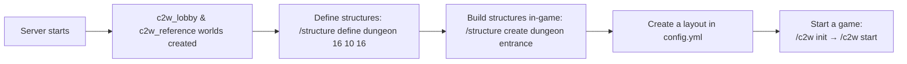

# Capture 2 Wool (C2W)

A fast-paced **Capture 2 Wool** minigame for Paper/Spigot servers. Two teams — Red and Blue — race to capture four colored wools. Pick up a wool, carry it to your team's capture point, and hold the zone to capture it. The first team to capture **two wools wins**.

---

## Quick Start

### Requirements

- **Paper** or **Spigot** server 1.21+
- **Java 25**
- [ProtocolLib](https://www.spigotmc.org/resources/protocollib.1997/) (soft-dependency — drop it in `plugins/` alongside the C2W jar)

### Installation

1. Download the latest `c2w-<version>.jar` from [Releases](https://github.com/klaaswhite/c2w/releases).
2. Drop the jar into your server's `plugins/` folder.
3. Restart the server (or run `/reload` — though a restart is cleaner).
4. Default config and structure files are created automatically on first run.

### Quick Setup (10 minutes)



**Step-by-step:**

1. **Define structure types** — `/structure define <name> <width> <height> <depth>`
2. **Build structures** — `/structure create <type> <id>` opens a void world. Build inside the particle boundary, then `/structure save`.
3. **Place markers** — Use `/marker create` to set wool spawns (`wool-red`, `wool-green`, `wool-blue`, `wool-yellow`), capture points (`cap-red`, etc.), and boundary boxes for pits and elevators.
4. **Configure a layout** — Add a layout to `plugins/c2w/config.yml` that references your structure types and marker positions.
5. **Launch a game** — `/c2w init` → `/c2w start <layout-name>`

Or just use the built-in `classic_5x7` layout to get started immediately.

---

## Commands

### Game commands (`/c2w`)

| Command | What it does |
|---|---|
| `/c2w init` | Creates the draft world, registers Red/Blue/Spectator teams, routes players in |
| `/c2w start [layout]` | Launches the game with the given layout (or the first one configured) |
| `/c2w end` | Ends the current game — players stay in the game world |
| `/c2w reset` | Full teardown: destroys draft + game worlds, rebuilds plugin state from scratch |
| `/c2w preview` | Shows which players are on which team |
| `/c2w ensurewools` | Respawns wool entities if they went missing |
| `/c2w layout list` | Lists all layouts from `config.yml` |
| `/c2w layout info <name>` | Shows grid and cell details for a layout |
| `/c2w setwooltimer <setting> <value>` | Tweak capture speed (interval, basecapture, increaseperplayer, etc.) |
| `/c2w getwooltimer` | Shows current capture timing settings |

### Structure commands (`/structure`)

Use these to define, build, and manage structures for your maps.

| Command | Where to use | What it does |
|---|---|---|
| `/structure define <type> <w> <h> <d>` | Lobby | Register a new structure type with dimensions |
| `/structure create <type> <id>` | Lobby | Opens a void world to build a structure |
| `/structure modify <type> <id>` | Lobby | Loads an existing NBT into a void world for editing |
| `/structure save` | Build world | Exports your build to an NBT file |
| `/structure discard` | Build world | Discards the build, destroys the void world |
| `/structure list` | Anywhere | Lists registered structure types and saved files |
| `/structure delete <type> <id>` | Lobby | Permanently removes a structure NBT file |
| `/structure resource world <type>` | Lobby | Opens a resource world to define chests/spawners |
| `/structure resource mark <resourceId>` | Resource world | Marks the block you're looking at as a resource instance |
| `/structure resource place <resourceId>` | Build world | Tags a position inside a structure as a resource spot |

### Marker commands (`/marker`)

Markers are invisible points in the world that tell the plugin where things should go.

| Command | What it does |
|---|---|
| `/marker create <player\|looking> <name>` | Places a marker at your feet or where you're looking |
| `/marker remove <name>` | Deletes a named marker |
| `/marker list` | Lists all markers in your current world |

### World commands (`/world`)

| Command | What it does |
|---|---|
| `/world teleport <lobby\|reference\|draft\|game>` | Teleport to any plugin-managed world |

---

## Game Flow

### How a match works

1. **Setup** — `/c2w init` creates the draft world and sorts players into teams.
2. **Start** — `/c2w start` generates the game world with all structures and wools.
3. **Play** — Pick up wools (they appear on your head), carry them to the **capture pit** or **elevator** on your team's side.
   - **Pit**: Stand in the pit with teammates. The more allies vs enemies in the pit, the faster you capture.
   - **Elevator**: Instant capture — walk in and the wool is yours.
4. **Win** — First team to capture 2 wools wins.
5. **Reset** — `/c2w reset` sends everyone back to the lobby, ready for the next game.

### Player routing

| Situation | What happens |
|---|---|
| Player joins before game starts | Teleported to `c2w_lobby` |
| Player joins during a live game | Put on Spectator team (gray), teleported into the game world |
| `/c2w init` runs | All online players move into the draft world |
| `/c2w reset` runs | All players go back to the lobby |

### Wool capture mechanics

- Pick up a wool → it appears on your head as a helmet.
- Stand in your team's **capture pit** with allies: the capture bar fills based on `base + (increasePerPlayer * allies) - (decreasePerPlayer * enemies)`.
- If enemies outnumber your team in the pit, progress is blocked (modifier forced to 0).
- Leave the pit and progress slowly decays.
- **Elevator** (boundary box): instant capture — just walk in.
- On death, the wool drops back into the world for anyone to pick up.
- **First to capture 2 wools wins.**

---

## Configuration

### `plugins/c2w/config.yml`

Created automatically on first run. Key settings:

| Key | Default | What it does |
|---|---|---|
| `layouts` | `classic_5x7` | Map blueprints — defines how structures are placed in the game world |
| `charMap` | — | Maps single characters in the layout grid to structure types |
| `gameOverTarget` | `draft` | Where players go when a game ends: `draft` or `lobby` |
| `lobbyAutoJoin` | `true` | Automatically teleport joiners to the lobby |
| `overrideOnStartup` | `false` | Whether to overwrite bundled structure files on each server start |

### `plugins/c2w/structures.yml`

Created on first run or via `/structure define`. Stores structure type dimensions and resource requirements:

```yaml
dungeon:
  width: 16
  height: 10
  depth: 16
  resources:
    chest-corridor1:
      min-spots: 2
```

### Layouts

A layout is a grid blueprint. Each cell in the grid maps to a structure type that gets placed in the game world. Layouts are defined in `config.yml`:

```yaml
layouts:
  my_map:
    tileWidth: 16
    tileHeight: 10
    tileDepth: 16
    origin: { x: 0, y: 0, z: 0 }
    grid: |
      D.C.D
      .S.S.
      T.C.T
    cellOverrides:
      - { row: 1, col: 1, x: 10, y: 5, z: 10 }
```

---

## Wool capture tuning

| Setting | Default | What it controls |
|---|---|---|
| `interval` | 20 ticks | How often the capture timer ticks |
| `basecapture` | 10 | Base capture speed per tick |
| `increaseperplayer` | 10 | Extra capture speed per ally in the pit |
| `decreaseperplayer` | 10 | Speed reduction per enemy in the pit |
| `decreaseoutsidearea` | 10 | Reserved (not yet used) |

Use `/c2w setwooltimer <setting> <value>` to adjust live, or change defaults in `config.yml`.

---

## Building from source

```bash
mvn clean package
```

The compiled jar is at `target/c2w-1.0-SNAPSHOT.jar`.

### Testing

```bash
mvn test
```

All tests are pure unit tests — no Minecraft server required.

### CI/CD

A GitHub Actions workflow builds and tests on every push/PR to `dev` and `main`. When you create a GitHub Release (tagged `v*`), the jar is automatically attached as a download.

---

## Releasing

1. Merge your feature into `dev`, then `dev` into `main`.
2. Tag a commit on `main` with a semantic version:

   ```bash
   git tag v1.0.0
   git push origin v1.0.0
   ```

3. Create a [GitHub Release](https://github.com/klaaswhite/c2w/releases) for that tag.
4. The CI workflow automatically attaches `c2w-v1.0.0.jar` to the release.

---

## Worlds managed by the plugin

| World | Persists? | What it's for |
|---|---|---|
| `c2w_lobby` | ✅ Yes | Waiting area between games |
| `c2w_reference` | ✅ Yes | Reference world for schematic data |
| `c2w_draft` | ❌ No | Pre-game staging (created / destroyed with each game) |
| `c2w_game` | ❌ No | Active game world (created / destroyed with each game) |
| `c2w_create_*` | ❌ No | Void worlds for building structures |
| `c2w_resource_*` | ❌ No | Void worlds for defining resource chests/spawners |

There is no `/c2w reload` that reads config changes from disk. Use `/c2w reset` (or its alias `/c2w reload`) instead.

---

## Need help?

- Check `plugins/c2w/` for your config and structure files.
- Run `/c2w` in-game to see available game commands.
- Run `/structure` for structure-building commands.
- File issues or contribute on [GitHub](https://github.com/klaaswhite/c2w).

For **developer documentation** (architecture, code structure, ops interfaces, marker system, contributing), see [ARCHITECTURE.md](ARCHITECTURE.md).

### `domain/` — Pure game logic (zero Bukkit imports, fully testable)

- `domain.model` — Domain entities (Wool, ManagedPlayer, ManagedTeam, etc.)
- `domain.game` — Application services (GameStateMachine, BoundaryEngine, PlayerRegistry, MarkerEngine, WoolTimer)
- `domain.ops` — Port interfaces for Bukkit interactions (MarkerOps, ServerOps, WoolOps, etc.)
- `domain.commands` — Command framework (CommandPiece, CommandInput, etc.)
- `domain.events` — Internal events (WoolCapturedEvent, StartGameEvent, etc.)
- `domain.managers` — Domain managers that coordinate using port interfaces (LayoutManager, StructureManager, NbtStructureSource)

### `adapter/` — Testable orchestration (testable via Ops fakes)

- `adapter.managers` — Thin adapters that wire domain services to Bukkit events (GameManager, BoundaryManager, PlayerManager, MarkerManager, etc.)
- `adapter.commands` — Command trees with Bukkit event wiring

### `bootstrap/` — Untestable Bukkit glue (direct Bukkit API, NOT unit-testable)

- `bootstrap.ops` — Concrete Bukkit implementations of domain port interfaces (BukkitMarkerOps, BukkitServerOps, etc.)
- `bootstrap.config` — Config file loading (PluginConfig, StructureTypeConfig, LayoutData)
- `bootstrap.listeners` — Bukkit/ProtocolLib event listeners
- `bootstrap.world` — World wrapper (ManagedWorld)
- `bootstrap.App` — The only wiring point, constructs every manager in the correct order
- `bootstrap.C2W` — JavaPlugin entry point
- `bootstrap.Managers` — Holder for all manager references

**Dependency rule:**
- `domain/` NEVER imports from `adapter/` or `bootstrap/` (pure domain, zero Bukkit)
- `adapter/` imports from `domain/` and `bootstrap/` for constructor parameter types
- `bootstrap/` is the bottom layer — imports from `adapter/` (for managers) and `domain/` (for port interfaces)
- Tests substitute fakes for bootstrap types via the `domain.ops` port interfaces

```
C2W (JavaPlugin)
  -> App
       -> PluginConfig         (loads config.yml)
       -> StructureTypeConfig  (loads structures.yml)
       -> WorldManager         (manages lobby / reference / creation / resource / draft / game worlds)
       -> EventManager         (root: registers Bukkit listeners + ProtocolLib packets)
       -> ServerOps            (BukkitServerOps — Bukkit server interactions)
       -> EntityManager        (item pickup listeners)
       -> PlayerManager        (players, teams, boss bars, death listeners)
       -> MarkerOps            (BukkitMarkerOps — marker entity interactions)
       -> MarkerManager        (named marker entities, creates Wools)
       -> NbtStructureSource   (loads/pastes NBT structure files)
       -> StructureManager     (structure template index + placement)
       -> StructureCreationManager (creation worlds for building structures)
       -> ResourceManager      (resource worlds for defining resource spots)
       -> BoundaryManager      (pit / elevator bounding boxes)
       -> LayoutManager         (map layouts from config)
       -> GameManager          (game state machine)
       -> CommandManager       (registers all commands)
```

### Dependency rules

- No service locator. Each manager declares the dependencies it needs in its constructor.
- No `Lazy<T>`, no class-keyed registry. The wiring is visible and explicit in `App`.
- Managers that need to react to events register themselves with `EventManager` in their constructor.

### Domain Services (Application Layer)

Between the Ops interfaces and the managers, pure-domain application services orchestrate game logic with zero Bukkit dependencies. Each service is tested independently:

| Service | Package | Tests | Responsibility |
|---|---|---|---|
| `GameStateMachine` | `domain.game` | 17 | Game lifecycle, state guards, win condition |
| `BoundaryEngine` | `domain.game` | 16 | Pit/elevator capture, modifier calculation |
| `PlayerRegistry` | `domain.game` | 18 | Player registration, team management, balancing |
| `MarkerEngine` | `domain.game` | 12 | Marker discovery, wool creation, entity management |
| `WoolTimer` | `classes` | 10 | Capture timing, per-wool tick scheduling |
| `LayoutManager` | `managers` | 6 | Layout parsing and resolution |

Managers now act as thin **interface adapters** — they construct these services and delegate to them, keeping Bukkit-specific concerns (event listeners, player messaging) in the adapter layer.

### Ops interfaces

Every Bukkit interaction is abstracted behind an interface (Ops pattern). Production code uses `*Bukkit*Ops` implementations; tests use `Fake*Ops` in-memory implementations. This enables full unit testing without a running Minecraft server.

| Interface | Production | Fake (test) |
|---|---|---|
| `ServerOps` | `BukkitServerOps` | Inline in tests |
| `MarkerOps` | `BukkitMarkerOps` | Inline in tests |
| `PlayerEntityOps` | `BukkitPlayerEntityOps` | Inline in tests |
| `WoolOps` | `BukkitWoolOps` | `FakeWoolOps` |
| `BlockOps` | `BukkitBlockOps` | Inline in tests |
| `PlayerHandle` | `BukkitPlayerHandle` | `FakePlayerHandle` |
| `ConfigAccess` | `BukkitConfigAccess` | `FakeConfigAccess` |

Only 3 hand-written fakes remain: `FakeWoolOps`, `FakePlayerHandle`, `FakeConfigAccess`. All are self-contained with zero external dependencies. Other interfaces use inline anonymous implementations in tests.

### Events

Two event channels flow through `EventManager`:

- **Minecraft events** — registered via `registerMinecraftEvent` and dispatched via `pushMinecraftEvent`. Wraps Bukkit's event bus without interfering with it.
- **Internal events** — registered via `registerInternalEvent` and dispatched via `pushInternalEvent`. Used for game-specific events like `WoolCapturedEvent` and `WoolDroppedEvent`.

## Markers

The plugin uses Bukkit `Marker` entities with persistent data tag `map_marker` to define points of interest in the world. Marker names are plain strings (no fixed enum), with two naming conventions:

### Game markers

| Name pattern | Purpose |
| --- | --- |
| `wool-<color>` | Where each wool spawns (`wool-red`, `wool-green`, `wool-blue`, `wool-yellow`) |
| `cap-<color>` | Where each wool is captured (`cap-red`, ...) — same color as its wool |
| `boundary-woolcap-pit-1` / `-2` | Two corners of the capture pit (forms a bounding box) |
| `boundary-woolcap-elevator-1` / `-2` | Two corners of the elevator (capture zone) |

The wool color is derived from the marker name: `wool-red` -> `RED_WOOL`, `wool-green` -> `GREEN_WOOL`, etc. The matching cap point is discovered in the same world as `cap-<color>`.

### Structure markers

Structure templates use a `structure-<type>-<id>-1` / `structure-<type>-<id>-2` naming convention for their corner markers. The type is a dynamic string (e.g. `dungeon`, `transition`, `center`, `spawn`, `corner`, `side`) that maps to either a `StructureType` enum value or a config-defined dynamic structure type. Any other marker whose position falls inside the bounding box is transported with the structure and re-emitted in the destination world at the translated position.

## NBT Structure System

Structures are stored as `.nbt` files on disk, not discovered from a template world. The file layout is:

```
plugins/c2w/
  structures.yml              # type definitions (dimensions + resource requirements)
  structures/
    <typeName>/
      <id>.nbt               # structure NBT file
  resources/
    <typeName>.nbt           # resource definition NBT
```

### Structure types

Structure types are defined via `/structure define <name> <width> <height> <depth>` and persisted to `structures.yml` by `StructureTypeConfig`. Each type declares its dimensions and optional resource requirements.

### Structure creation worlds

Structures are built in transient void "creation worlds" (`c2w_create_<type>_<id>`):

1. `/structure create <type> <id>` — creates a void world with a particle boundary showing the structure dimensions.
2. Build the structure inside the boundary.
3. `/structure save` — exports the world region to an NBT file at `structures/<type>/<id>.nbt`.
4. `/structure discard` — destroys the world without saving.

Use `/structure modify <type> <id>` to load an existing NBT into a fresh creation world for editing.

### Resource system

Resources (e.g. chests, spawners) are defined in "resource worlds" (`c2w_resource_<type>`):

1. `/structure resource world <type>` — opens a void world for resource definition.
2. Place tile entities (chests, spawners, etc.) in the world.
3. `/structure resource mark <resourceId>` — marks targeted tile entities with an auto-incrementing counter.
4. `/structure save` — saves the resource world to `resources/<type>.nbt`.
5. `/structure discard` — destroys without saving.

During structure transport, resources are placed at the marked positions within the structure instance.

## Configuration

### config.yml

The plugin reads its config from `plugins/c2w/config.yml`. A default is shipped with the plugin and is copied on first run.

Override on startup behavior:
  false (default):
    Only extract if files don't exist.
    Once created on the server, they persist across plugin updates.
  true:
    Always overwrite with the plugin-bundled versions.
    Use when updating the plugin with new/updated structures.

| Key | Type | Default | Purpose |
|---|---|---|---|
| `layouts` | map of layout name -> layout def | Named map blueprints. See "Layouts" below. |
| `charMap` | map of single char -> `StructureType` | Resolves each cell in a layout grid. |
| `gameOverTarget` | `draft` \| `lobby` | `draft` | Where players are sent when a game ends. |
| `lobbyAutoJoin` | bool | `true` | If `true`, joiners are teleported to `c2w_lobby` until `/c2w init`. |
| `overrideOnStartup` | bool | `false` | If `true`, overwrites bundled structures on every startup. If `false`, only extracts missing files. |

### structures.yml

Managed by `StructureTypeConfig` separately from `config.yml`. Contains structure type definitions with dimensions and resource requirements:

```yaml
dungeon:
  width: 16
  height: 10
  depth: 16
  resources:
    chest-corridor1:
      min-spots: 2
    spawner-room1:
      min-spots: 1
```

### Layouts

Each entry under `layouts` is a layout blueprint. A layout has:

- `tileWidth`, `tileHeight`, `tileDepth` (integers) — the footprint of a cell in world blocks.
- `origin` (`x`, `y`, `z`) — the world-space anchor of cell (row=0, col=0).
- `grid` — a multi-line string of single-character cells, one row per line.
- `cellOverrides` (optional) — a list of `{row, col, x, y, z}` entries for free-form placement.

The shipped `classic_5x7` layout is the 5-row by 7-column example from the design doc.

## Game flow

The plugin manages two persistent worlds (`c2w_lobby`, `c2w_reference`) and several transient per-game worlds (`c2w_draft`, `c2w_game`, creation worlds, resource worlds).

1. **`/c2w init`** — creates the `c2w_draft` world, registers the Red/Blue/Spectator teams, routes all online players into the draft world.
2. Add players to teams using the scoreboard `/team` command (the plugin picks up team changes through the ProtocolLib `ChangeTeamPacketListener`).
3. **`/c2w preview`** — lists players by team.
4. **`/c2w start [layout]`** — creates the `c2w_game` world, places structures (per the chosen layout) using NBT files, drops wools at their SPAWN-structure marker points, and teleports everyone from the draft world into the game world.
5. **Carry and capture** — players pick up a wool, it appears on their head. While standing in the pit with teammates (and no enemies), the capture progress bar fills. Walking into the elevator instantly captures the wool. The first team to capture two wools wins.
6. **`/c2w end`** — transitions the game into `GAME_ENDED`. Players stay in the game world.
7. **`/c2w reset`** (alias `/c2w reload`) — teleports everyone to the lobby, tears down every manager (closes AutoCloseables in reverse construction order), destroys the draft and game worlds, and re-initializes the entire plugin state from scratch. Use this between games.

### Player routing

| Event | Behaviour |
| --- | --- |
| Player joins before `/c2w init` | If `lobbyAutoJoin: true` (default) the player is teleported to `c2w_lobby`. |
| Player joins during `GAME_IN_PROGRESS` | Added to the `Spectator` team (gray) and teleported into the game world. |
| `/c2w init` | All online players are routed into the new draft world. |
| `/c2w reset` | All online players are routed to the lobby. |

## Commands

### Game commands (`/c2w`)

| Command | Description |
| --- | --- |
| `/c2w init` | Initialize a new game (create draft, reset teams, route players) |
| `/c2w start [layout]` | Start a game with the named layout (defaults to the first configured layout) |
| `/c2w end` | End the current game (players stay in the game world) |
| `/c2w reset` | Tear down the draft + game worlds and rebuild all plugin state |
| `/c2w reload` | Alias for `/c2w reset` |
| `/c2w preview` | Show which players are in which team |
| `/c2w ensurewools` | Respawn the wool entities if they got lost |
| `/c2w layout list` | List the layouts configured in `config.yml` |
| `/c2w layout info <name>` | Show a layout's grid + cell origin/structure-type |
| `/c2w setwooltimer <setting> <value>` | Adjust wool capture speed settings |
| `/c2w getwooltimer` | Show the current wool capture settings |

### Structure commands (`/structure`)

| Command | Context | Description |
| --- | --- | --- |
| `/structure define <type> <w> <h> <d>` | Lobby | Define a structure type with dimensions |
| `/structure create <type> <id>` | Lobby | Create a new structure instance (opens creation world) |
| `/structure modify <type> <id>` | Lobby | Edit an existing structure (loads NBT into creation world) |
| `/structure list` | Any | List structure types and saved instances |
| `/structure delete <type> <id>` | Lobby | Delete a structure NBT |
| `/structure save` | Creation/Resource world | Save and exit |
| `/structure discard` | Creation/Resource world | Discard and exit |
| `/structure resource world <type>` | Lobby | Open resource definition world |
| `/structure resource place <resourceId>` | Creation world | Place resource spot marker |
| `/structure resource mark <resourceId>` | Resource world | Mark targeted block as resource instance |

### Marker commands (`/marker`)

| Command | Description |
| --- | --- |
| `/marker create <player\|looking> <name>` | Create a marker at your position or where you're looking |
| `/marker remove <name>` | Remove a named marker |
| `/marker list` | List all markers in your current world |

### World commands (`/world`)

| Command | Description |
| --- | --- |
| `/world teleport <lobby\|reference\|draft\|game>` | Teleport to one of the plugin-managed worlds |

## Wool capture mechanics

When a player picks up a wool:

- The wool item is removed from the world.
- The player wears it as a helmet.
- A per-player boss bar is registered, showing capture progress.
- A death listener is registered so that on death the wool drops back into the world.

While a player is in the capture pit (the box defined by `boundary-woolcap-pit-1` and `-2`):

- The capture progress increases by `baseCapture + (increasePerPlayer * allies) - (decreasePerPlayer * enemies)` per tick.
- If the player's team has fewer allies in the pit than enemies, the modifier is forced to 0.
- Walking out of the pit decreases progress at a fixed rate.
- When the bar reaches the cap, the wool is captured, the helmet is removed, a `WoolCapturedEvent` fires, and the cap marker location gets a block of the matching wool color.

When a player walks into the elevator (the box defined by `boundary-woolcap-elevator-1` and `-2`), the wool is captured immediately.

## Wool capture timing

The `WoolTimer` runs on a `BukkitTask` that's only scheduled while at least one wool is being timed. All settings are static `AtomicInteger`s, queryable via `/c2w getwooltimer`:

- `interval` — ticks between timer updates (default 20)
- `basecapture` — base capture speed per tick (default 10)
- `increaseperplayer` — additional capture per ally in pit (default 10)
- `decreaseperplayer` — capture loss per enemy in pit (default 10)
- `decreaseoutsidearea` — (reserved, currently unused) (default 10)

## Project layout

```
src/main/java/net/klaaswhite/c2w/
  bootstrap/
    App.java                        - wiring root
    C2W.java                        - JavaPlugin entry point
    Managers.java                   - holder for all manager references
    config/                         - config loading (PluginConfig, StructureTypeConfig, LayoutData)
    listeners/                      - Bukkit Listener adapters that forward into EventManager
    ops/                            - Bukkit implementations of domain port interfaces (BukkitMarkerOps, BukkitServerOps, ...)
    world/                          - ManagedWorld + chunk generator helpers
  domain/
    commands/                       - command framework (CommandPiece, CommandInput, Tree/List/DynamicList)
    events/                         - internal events (DraftCreated, StartGame, WoolCaptured, ...)
    game/                           - domain services (GameStateMachine, BoundaryEngine, PlayerRegistry, MarkerEngine, Wool, WoolTimer)
    managers/                       - domain managers with port dependencies (LayoutManager, StructureManager, NbtStructureSource)
    model/                          - domain types (BlockPos, ManagedPlayer, ManagedTeam, WoolOps interface, ...)
    ops/                            - port interfaces (MarkerOps, ServerOps, StructureOps, PlayerHandle, ...)
  adapter/
    commands/                       - Bukkit command trees (/c2w, /structure, /marker, /world)
    managers/                       - Bukkit adapter managers (GameManager, BoundaryManager, PlayerManager, MarkerManager, ...)
```

## Test Coverage

Domain classes and services are fully unit-testable with zero Bukkit dependencies. Tests use fake implementations of the Ops interfaces. The test directory mirrors the main source:

```
src/test/java/net/klaaswhite/c2w/
  domain/                  - domain tests (all testable without Bukkit)
    events/                - event tests
    game/                  - domain service tests (GameStateMachine, BoundaryEngine, PlayerRegistry, MarkerEngine, WoolTimer)
    managers/              - domain manager tests (LayoutManager, StructureManager)
    model/                 - domain entity tests (Wool, ManagedPlayer, ManagedTeam, ...)
  adapter/                 - adapter tests (require Bukkit fakes)
    managers/              - GameManager test
  bootstrap/               - bootstrap tests (require actual server)
    config/                - PluginConfig test
  fakes/                   - reusable Fake* implementations of domain port interfaces
  worlds/                  - world tests
```

### Domain Entities

| Class | Tests | Coverage |
|---|---|---|
| `Wool` | WoolTest (20+ tests) | State machine: pickup, drop, capture, tick, CAP_AMOUNT |
| `ManagedPlayer` | ManagedPlayerTest (12 tests) | Team assignment, removeTeam, carry logic |
| `ManagedTeam` | ManagedTeamTest (7 tests) | Player add/remove, colors, static registry |
| `MapLayout` | MapLayoutTest (9 tests) | Layout dimensions, cells, defensive copy |
| `BlockPos` | BlockPosTest | Position record, toString |
| `BlockDef` | BlockDefTest | Block definition parsing |
| `StructureTemplate` | StructureTemplateTest | Template data |

### Domain Services

| Service | Tests | Coverage |
|---|---|---|
| `GameStateMachine` | GameStateMachineTest (17 tests) | Lifecycle, guards, transitions, layout resolution, win conditions |
| `BoundaryEngine` | BoundaryEngineTest (16 tests) | Pit enter/exit, elevator capture, modifier calc, reset, overlapping boxes |
| `PlayerRegistry` | PlayerRegistryTest (18 tests) | Registration, lookup, team management, balanceTeams, reset |
| `MarkerEngine` | MarkerEngineTest (12 tests) | Marker discovery, getMarkersInWorld, initWools, entity wools, close |
| `WoolTimer` | WoolTimerTest (10 tests) | Register/unregister, tick scheduling, defaults |

### Adapter Managers

| Class | Tests | Coverage |
|---|---|---|
| `GameManager` | GameManagerTest | State transitions (basic) |
| `LayoutManager` | LayoutManagerTest | Layout parsing (basic) |
| `StructureManager` | StructureManagerTest | Template discovery (basic) |

## Notes / known TODOs

- All manager state is in memory. `/c2w reset` is the only way to rebuild that state cleanly; the plugin does not persist anything across server restarts.
- Future work: layout-aware wool spawn points, scoring persistence, and a Spectator-mode flag that hides live players.
